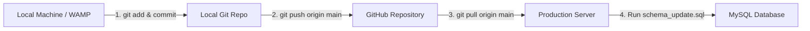

# GitHub Deployment Guide: Pushing & Pulling Updates

This document provides a step-by-step guide on how to push local development updates to **GitHub** and pull them onto your **production server** (WAMP / Linux VPS / cPanel).

---

## Workflow Overview



---

## Step 1: Pushing Changes from Local Machine to GitHub

Run these commands in your local project terminal (`c:\wamp64\www\afbmangaan`):

```bash
git status
git add .
git commit -m "New Feature - Add Categories for pastors, leaders, ministers & Logout page session management"
git push origin main
```

---

## Step 2: Pulling Changes on Your Production Server (`srv1313830`)

### 1. Navigate into the web directory
```bash
cd /var/www/html
```

### 2. Configure Git Safe Directory (REQUIRED on Linux Servers)
Run this command to resolve Git owner permission warnings on Linux:
```bash
git config --global --add safe.directory /var/www/html
```

### 3. Pull the latest code from GitHub
```bash
git fetch origin
git pull origin main
```

### 4. Verify local status
```bash
git status
```
*Expected Output:* `Your branch is up to date with 'origin/main'.`

---

## Step 3: Executing Database Schema Updates

Whenever a deployment includes database updates (e.g., `schema_update.sql`), run the SQL update on the server's MySQL database.

### Option A: Via Command Line (Linux MySQL CLI)
```bash
mysql -u root -p afb_mangaan_db < schema_update.sql
```

### Option B: Via phpMyAdmin
1. Open **phpMyAdmin**.
2. Select your database (`afb_mangaan_db`).
3. Click the **SQL** tab.
4. Copy the entire contents of [schema_update.sql](file:///c:/wamp64/www/afbmangaan/schema_update.sql), paste into the editor, and click **Go**.

---

## First-Time Server Setup (If repository is NOT YET cloned)

If setting up a brand-new server without Git initialized:

```bash
cd /var/www
git clone https://github.com/Dane-22/afbmangaan.git html
cd html
git config --global --add safe.directory /var/www/html
```

---

## Troubleshooting & Server Command Reference

### If Git throws "fatal: detected dubious ownership in repository"
Run this command once:
```bash
git config --global --add safe.directory /var/www/html
```

### If `git pull` fails due to uncommitted local server changes
```bash
git stash
git pull origin main
```

### Check recent commit history on server
```bash
git log -n 5 --oneline
```
