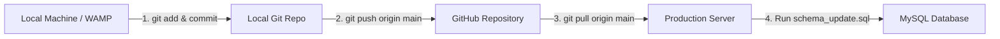

# GitHub Deployment Guide: Pushing & Pulling Updates

This document provides a step-by-step guide on how to push local development updates to **GitHub** and pull them onto your **production server** (WAMP / Linux VPS / cPanel).

---

## Workflow Overview



---

## Step 1: Pushing Changes from Local Machine to GitHub

Run these commands in your local project terminal (`c:\wamp64\www\afbmangaan`):

```bash
git status
git add .
git commit -m "New Feature - Add Categories for pastors, leaders, ministers & Logout page session management"
git push origin main
```

---

## Step 2: Pulling Changes on Your Linux Server (`srv1313830`)

### Option A: If your website folder ALREADY exists on the server

1. **Find where your website directory is located on the server**:
   Run one of these commands on your server:
   ```bash
   find /var/www -maxdepth 3 -type d -name "*afb*" 2>/dev/null
   ```
   *Common locations:*
   - Ubuntu / Debian: `/var/www/html/afbmangaan` or `/var/www/afbmangaan`
   - cPanel: `/home/USERNAME/public_html` or `/var/www/html`

2. **Navigate into the project directory**:
   ```bash
   cd /var/www/html/afbmangaan
   ```
   *(Replace `/var/www/html/afbmangaan` with your actual folder path found in step 1)*

3. **Pull the latest code from GitHub**:
   ```bash
   git fetch origin
   git pull origin main
   ```

---

### Option B: If the website is NOT YET cloned on the server (First-time Setup)

If you haven't cloned the Git repository on the server yet:

1. **Navigate to the web root directory**:
   ```bash
   cd /var/www/html
   ```

2. **Clone the repository from GitHub**:
   ```bash
   git clone https://github.com/Dane-22/afbmangaan.git
   ```

3. **Navigate into the cloned repository**:
   ```bash
   cd afbmangaan
   ```

---

## Step 3: Executing Database Schema Updates

Whenever a deployment includes database updates (e.g., `schema_update.sql`), run the SQL update on the server's MySQL database.

### Option A: Via Command Line (Linux MySQL CLI)
```bash
mysql -u root -p afb_mangaan_db < schema_update.sql
```

### Option B: Via phpMyAdmin
1. Open **phpMyAdmin**.
2. Select your database (`afb_mangaan_db`).
3. Click the **SQL** tab.
4. Copy the contents of [schema_update.sql](file:///c:/wamp64/www/afbmangaan/schema_update.sql) and paste it into the query box, then click **Go**.

---

## Troubleshooting & Useful Server Commands

### How to check where Apache / Nginx points on your server
```bash
grep -rn "DocumentRoot" /etc/apache2/ /etc/httpd/ /etc/nginx/ 2>/dev/null
```

### If `git pull` fails due to uncommitted local server changes
```bash
git stash
git pull origin main
```
