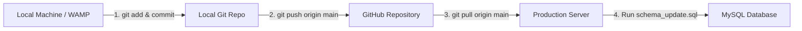

# GitHub Deployment Guide: Pushing & Pulling Updates

This document provides a step-by-step guide on how to push local development updates to **GitHub** and pull them onto your **production server** (WAMP / cPanel / VPS).

---

## Workflow Overview



---

## Step 1: Pushing Changes from Local Machine to GitHub

Run these commands in your local project terminal (`c:\wamp64\www\afbmangaan`):

### 1. Check modified files
```bash
git status
```

### 2. Stage modified files
```bash
git add .
```

### 3. Commit staged changes with a descriptive message
```bash
git commit -m "New Feature - Add Categories for pastors, leaders, ministers & Logout page session management"
```

### 4. Push to GitHub repository
```bash
git push origin main
```

---

## Step 2: Pulling Changes onto the Server

On your **production server** terminal / SSH console or command prompt:

### 1. Navigate to the project root directory
- **Windows (WAMP / IIS):**
  ```powershell
  cd c:\wamp64\www\afbmangaan
  ```
- **Linux (Apache / Nginx):**
  ```bash
  cd /var/www/html/afbmangaan
  ```

### 2. Fetch and pull the latest code from GitHub
```bash
git fetch origin
git pull origin main
```

### 3. Verify that the server is up-to-date
```bash
git status
```
*Output should show:* `Your branch is up to date with 'origin/main'.`

---

## Step 3: Executing Database Schema Updates

Whenever a deployment includes database updates (e.g., `schema_update.sql`), run the SQL update on the server's MySQL database.

### Option A: Via phpMyAdmin (Recommended for WAMP / cPanel)
1. Open **phpMyAdmin**.
2. Select your database (`afb_mangaan_db`).
3. Click the **SQL** tab.
4. Copy the entire contents of [schema_update.sql](file:///c:/wamp64/www/afbmangaan/schema_update.sql).
5. Paste into the SQL editor and click **Go**.

### Option B: Via Command Line (MySQL CLI)
```bash
mysql -u root -p afb_mangaan_db < schema_update.sql
```

---

## Troubleshooting & Tips

### Handling Local Uncommitted Changes on Server
If `git pull` fails because of local server edits:
```bash
# Temporarily stash local server changes
git stash

# Pull latest code from GitHub
git pull origin main

# (Optional) Re-apply stashed changes if needed
git stash pop
```

### View Recent Commit History
```bash
git log -n 5 --oneline
```
