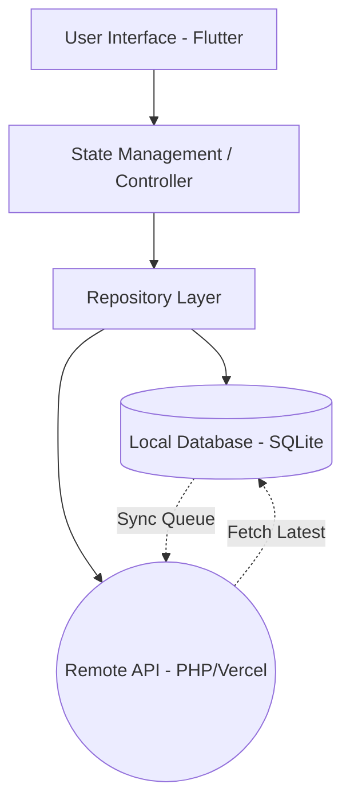
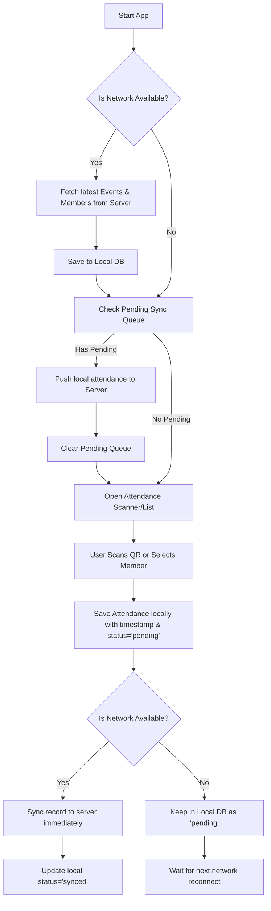

# Mobile Application Implementation Plan: AFB Mangaan Attendance

This document outlines the architecture, design, and implementation plan for the mobile application counterpart of the AFB Mangaan Attendance & Analytics System, focusing heavily on offline-first capabilities.

## Goal Description
Develop a mobile application that allows operators and admins to record member attendance via QR scanning or manual search, even without an active internet connection. The app will cache attendance records locally and synchronize them with the main server once connectivity is restored.

## User Review Required
> [!IMPORTANT]
> **Tech Stack Selection:** I am proposing **Flutter** for the mobile app framework and **SQLite (or Isar)** for the local database, as Flutter provides excellent cross-platform (iOS/Android) performance and robust offline capabilities. Please confirm if you prefer Flutter, React Native, or another framework.
> 
> **Backend Synchronization:** We will need to create new, specific API endpoints on the existing PHP/MySQL or Vercel backend to handle bulk synchronization and conflict resolution (e.g., if a user was marked present by two different offline devices).

## Recommendations for Implementation
> [!TIP]
> Based on the core requirements of the system, here are my recommendations for the initial mobile app scope:
> 
> 1. **Scope of Features**: The mobile app should strictly be used for **taking attendance and viewing events**. Handling full member CRUD operations (adding/editing members) offline introduces complex data collision issues. Complex administrative tasks should remain on the web dashboard.
> 2. **Target Audience**: The mobile app should be used **strictly by Admins and Operators**. Developing a member-facing app would require building a completely new authentication system for members and designing a different interface. Focusing on Operators solves the immediate goal of reliable offline attendance tracking.

---

## 1. Architecture

The app will follow an **Offline-First Architecture** utilizing the Repository Pattern to abstract data sources.



- **Local Database**: Stores a localized copy of Members and Events. Stores pending Attendance records.
- **Sync Service**: A background worker that monitors connectivity changes and processes the sync queue.

---

## 2. Folder Structure

Proposed structure using a feature-first approach in Flutter:

```text
lib/
├── core/
│   ├── network/           # Network connectivity checker
│   ├── database/          # SQLite configuration and tables
│   ├── api/               # Dio/HTTP client setup
│   └── utils/             # Helpers, constants, theme
├── features/
│   ├── auth/              # Login & Session management
│   ├── events/            # Event listing and selection
│   ├── members/           # Member directory (cached)
│   ├── attendance/        # QR Scanner & Manual entry
│   └── sync/              # Sync status UI & background logic
├── models/                # Data classes (Event, Member, Attendance)
└── main.dart              # Entry point
```

---

## 3. Flowchart: Offline Attendance & Sync



---

## 4. Algorithm & Pseudocode

### A. Recording Attendance (Offline-First)

```python
function recordAttendance(eventId, memberId, scanMethod):
    # 1. Create a record with current timestamp and 'pending' status
    record = new AttendanceRecord(
        eventId=eventId,
        memberId=memberId,
        method=scanMethod,
        timestamp=getCurrentTime(),
        syncStatus="PENDING"
    )
    
    # 2. Save to local SQLite database
    localDatabase.insert(record)
    
    # 3. Attempt immediate sync if online
    if network.isConnected():
        triggerSyncWorker()
        
    return "Attendance recorded successfully"
```

### B. Background Sync Algorithm

```python
function processSyncQueue():
    # 1. Get all pending records
    pendingRecords = localDatabase.getRecords(syncStatus="PENDING")
    
    if pendingRecords.isEmpty():
        return
        
    # 2. Prepare payload for bulk insert
    payload = { "attendance": pendingRecords }
    
    try:
        # 3. Send to backend sync endpoint
        response = api.post("/api/sync_attendance", payload)
        
        if response.status == 200:
            # 4. Mark records as synced locally based on server response
            syncedIds = response.data.syncedIds
            for id in syncedIds:
                localDatabase.updateStatus(id, "SYNCED")
                
    except NetworkException:
        # 5. Failed to reach server, keep as pending
        log("Sync failed, will retry later")
```

---

## 5. Verification Plan

### Automated Tests
- Unit tests for the Local Database to ensure `syncStatus` toggles correctly.
- Mock the API layer to simulate network failures and verify records remain in the `PENDING` state.

### Manual Verification
1. Log into the mobile app while connected to Wi-Fi.
2. Turn on **Airplane Mode** (disconnect internet).
3. Scan a QR code or manually record attendance for 3 members.
4. Verify the UI shows a "Pending Sync" indicator.
5. Turn off Airplane Mode (reconnect internet).
6. Verify the app automatically syncs the data in the background and the indicator disappears.
7. Check the web dashboard to confirm the 3 members are marked present with the correct offline timestamps.
