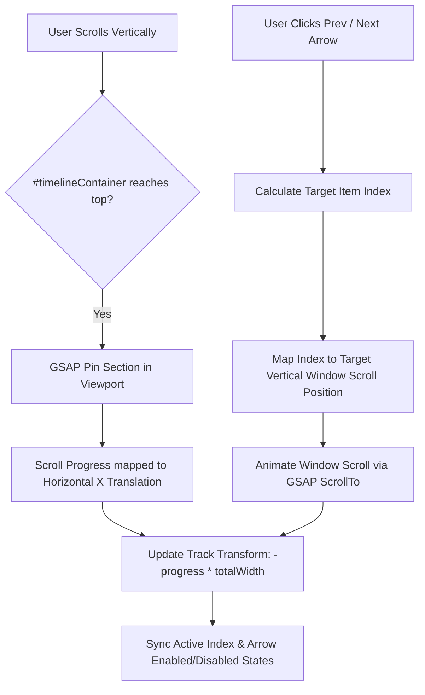

# Technical Documentation: "Our Journey" Horizontal Scrolling Carousel

## 1. Executive Summary & Overview

The **"Our Journey"** section (`#history`) on the main landing page (`index.php`) features a modern **pinned horizontal scrolling timeline carousel**. It presents the historical milestones of AFB Santol / AFB Mangaan (from 1975 to 2024) in an interactive, high-end visual experience.

Rather than relying on traditional vertical text lists or standard touch carousels, this component converts vertical page scroll into smooth horizontal track movement via **GSAP (GreenSock Animation Platform)** and **ScrollTrigger**.

---

## 2. Architecture & File Breakdown

The horizontal timeline carousel relies on three primary files:

| Technology Layer | Source File | Description / Purpose |
| :--- | :--- | :--- |
| **Markup (HTML)** | [`index.php`](file:///c:/wamp64/www/afbmangaan/index.php#L151-L227) | Contains section structure, timeline track, milestones, and navigation arrows. |
| **Styles (CSS)** | [`style.css`](file:///c:/wamp64/www/afbmangaan/style.css#L636-L790) | Controls layout, item cards, typography, absolute positioning, hover effects, and responsive breakpoints. |
| **Script (JS)** | [`animations.js`](file:///c:/wamp64/www/afbmangaan/animations.js#L305-L440) | Controls GSAP pinning, ScrollTrigger scrub, arrow navigation calculation, and state updates. |

---

## 3. DOM & HTML Structure

The timeline HTML is structured with a pinned wrapper container (`#timelineContainer`), navigation buttons, and a flexible horizontal track (`#timelineTrack`):

```html
<!-- Horizontal Timeline Section -->
<section class="timeline-section" id="history">
    <div class="timeline__header">
        <span class="section__eyebrow">Our Journey</span>
        <h2 class="section__title">A Legacy of Faith</h2>
    </div>
    
    <div class="timeline__container" id="timelineContainer">
        <!-- Navigation Arrow Controls -->
        <button class="timeline__arrow timeline__arrow--left" id="timelinePrev" aria-label="Previous timeline item">
            <i class="ph ph-caret-left"></i>
        </button>
        <button class="timeline__arrow timeline__arrow--right" id="timelineNext" aria-label="Next timeline item">
            <i class="ph ph-caret-right"></i>
        </button>
        
        <!-- Horizontal Scroll Track -->
        <div class="timeline__track" id="timelineTrack">
            <!-- Timeline Item 1 -->
            <div class="timeline__item">
                <div class="timeline__year">1975</div>
                <div class="timeline__card">
                    <div class="timeline__icon"><i class="ph ph-seedling"></i></div>
                    <h3 class="timeline__title">Humble Beginnings</h3>
                    <p class="timeline__desc">A small group of faithful believers...</p>
                </div>
            </div>

            <!-- Additional items: 1985, 2005, 2018, 2024 -->
        </div>
    </div>
</section>
```

---

## 4. Layout & CSS System

### Key CSS Classes & Rules ([`style.css`](file:///c:/wamp64/www/afbmangaan/style.css#L636-L790))

1. **Container (`.timeline__container`)**:
   - `position: relative`
   - Fixed height (`500px`) serving as the viewport window for the moving track.

2. **Track (`.timeline__track`)**:
   - `display: flex; gap: 4rem;`
   - `position: absolute; top: 0; left: 0; height: 100%;`
   - `padding: 0 calc(50vw - 200px);` centered padding calculated so that the first item aligns perfectly in the middle of screen upon initial pin.

3. **Items & Cards (`.timeline__item`, `.timeline__card`)**:
   - `flex-shrink: 0; width: 400px;` (width drops to `300px` on mobile $\le 768\text{px}$).
   - Includes micro-hover animation (`transform: scale(1.05)`).

4. **Navigation Controls (`.timeline__arrow`)**:
   - Positioned floating over the section (`bottom: 2rem`, `left: 2rem` / `right: 2rem`).
   - Uses `var(--accent)` golden borders and background transitions.
   - Styled `:disabled` state (`opacity: 0.3`, `cursor: not-allowed`).

---

## 5. JavaScript Engine & Animation Logic

The interactive logic is managed by `initHorizontalTimeline()` in [`animations.js`](file:///c:/wamp64/www/afbmangaan/animations.js#L312-L440).

### 5.1 GSAP ScrollTrigger Pinning & Scrubbing

```js
const totalWidth = track.scrollWidth - window.innerWidth;

const horizontalTrigger = ScrollTrigger.create({
    trigger: container,
    start: 'top top',
    end: () => `+=${totalWidth}`,
    pin: true,
    scrub: 1,
    anticipatePin: 1,
    onUpdate: (self) => {
        // Calculate translation based on scroll progress (0 to 1)
        const xPos = -self.progress * totalWidth;
        gsap.set(track, { x: xPos });
        
        // Update current item index for button state sync
        currentIndex = Math.round(self.progress * maxIndex);
        updateArrowButtons();
    },
    onEnter: () => {
        // Sacred seal visibility trigger
        gsap.to('#sacredSeal', { x: 0, duration: 0.5, ease: 'power2.out' });
        updateArrowButtons();
    },
    onLeave: () => {
        gsap.to('#sacredSeal', { x: 150, duration: 0.5, ease: 'power2.in' });
    }
});
```

#### How Scroll Scrubbing Works:
- **`pin: true`**: As `#timelineContainer` hits the top of the browser viewport (`start: 'top top'`), GSAP pins the section in place.
- **`end: () => '+=' + totalWidth`**: Vertical scrolling distance is dynamically bound to the horizontal overflow width (`track.scrollWidth - window.innerWidth`).
- **`scrub: 1`**: Maps mousewheel/touch vertical scroll distance linearly to horizontal translation (`x: -self.progress * totalWidth`) with a subtle 1-second smoothing delay.

---

### 5.2 Manual Arrow Button Navigation

Users can click the left (`#timelinePrev`) and right (`#timelineNext`) arrow buttons for programmatic step-by-step navigation.

```js
function navigateToItem(index) {
    currentIndex = Math.max(0, Math.min(index, maxIndex));
    
    // Proportional progress index calculation
    const targetProgress = currentIndex / maxIndex;
    const scrollStart = container.offsetTop;
    const scrollDistance = totalWidth;
    const targetScroll = scrollStart + (targetProgress * scrollDistance);
    
    // Scroll window vertically to trigger ScrollTrigger update
    gsap.to(window, {
        duration: 0.8,
        scrollTo: { y: targetScroll, autoKill: false },
        ease: 'power2.inOut',
        onComplete: () => {
            const xPos = -targetProgress * totalWidth;
            gsap.set(track, { x: xPos });
        }
    });
    
    updateArrowButtons();
}
```

---

## 6. Flow Diagram



---

## 7. Responsive & Accessibility Handling

- **Mobile Viewport Adjustment ($\le 768\text{px}$)**:
  - Card width is scaled down from `400px` to `300px`.
  - Year label typography is reduced from `4rem` to `3rem`.
  - Arrow buttons contract from `50px` to `40px` and move inward (`0.5rem`).
- **Reduced Motion Support**:
  - Complies with `@media (prefers-reduced-motion: reduce)` by disabling aggressive transitions and resetting hardware acceleration properties (`will-change: auto`).

---

## 8. Summary of Milestones Displayed

1. **1975 — Humble Beginnings** (`ph-seedling`)
2. **1985 — Sanctuary Built** (`ph-house`)
3. **2005 — Community Expansion** (`ph-users-three`)
4. **2018 — Lettac Sur Branch** (`ph-buildings`)
5. **2024 — Digital Transformation** (`ph-qr-code`)
